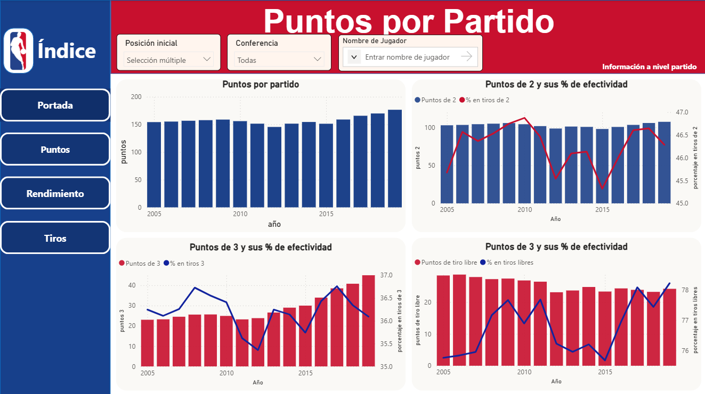
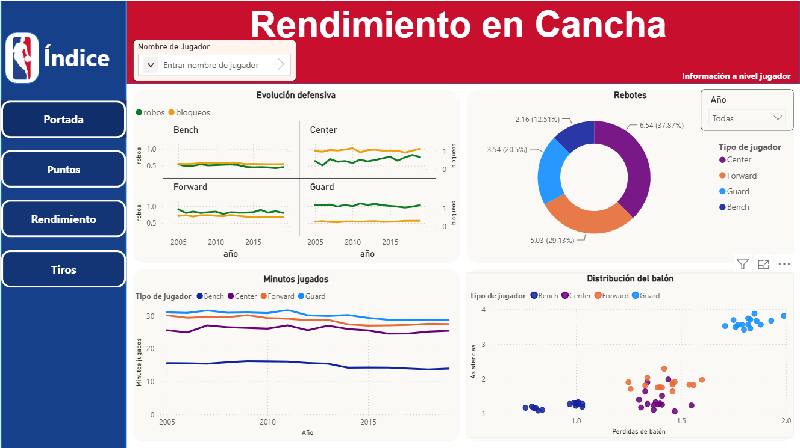
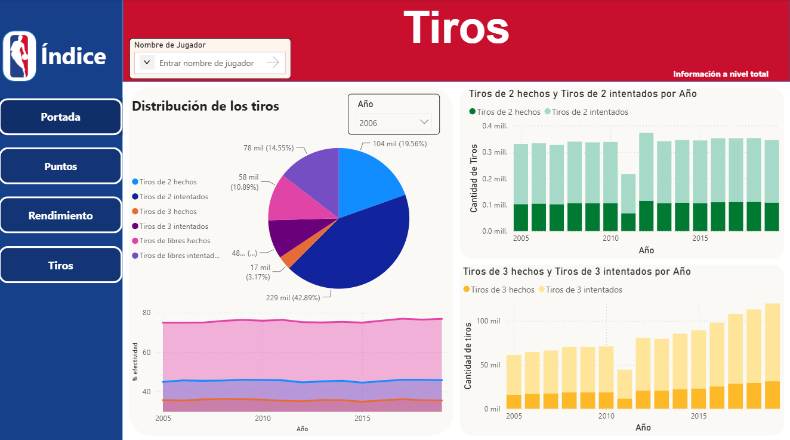

# Análisis de las principales estadísticas de los jugadores de la NBA

**Alumno:** Christian Castillo Reynoso

## 📋 Resumen ejecutivo

| Campo                  | Valor                                                                                                                                                                                                                                                                          |
| ---------------------- | ------------------------------------------------------------------------------------------------------------------------------------------------------------------------------------------------------------------------------------------------------------------------------ |
| **Pregunta analítica** | Entre 2005 y 2019, el promedio de puntos por partido en la NBA aumentó de forma considerable. ¿Este incremento puede explicarse por una mejora en la efectividad de los tiros de campo, los triples y los tiros libres, o responde a cambios en el estilo de juego de la liga? |
| **Dataset**            | NBA Games Data                                                                                                                                                                                                                                                                 |
| **Fuente**             | [nba.data — Bases de datos](https://www.kaggle.com/datasets/nathanlauga/nba-games/data)                                                                                                                                                                                        |
| **Modelo**             | Esquema estrella compuesto por 1 tabla de hechos y 5 dimensiones (`game`, `player`, `team`, `start_position` y `date`).                                                                                                                                                        |
| **Infraestructura**    | Amazon Aurora PostgreSQL en AWS (clúster `aurora-mod4`, esquema `nba_dwh_py`).                                                                                                                                                                                                    |
| **ETL**                | Proceso ETL end-to-end implementado en `etl.ipynb`, utilizando `pandas`, `SQLAlchemy` y validaciones posteriores a la carga.                                                                                                                                             |
| **SQL avanzado**       | Tres consultas SQL avanzadas, dos de ellas utilizando CTE y funciones de ventana, para identificar a los jugadores con mayor cantidad de puntos anotados y con mayor efectividad de tiro por temporada. Los resultados se utilizan como insumo para el dashboard.              |
| **Dashboard**          | Dashboard desarrollado en Power BI con cuatro páginas: portada, puntos por partido, rendimiento en cancha y tiros.                                                                                                                                                             |

## 🏀 Contexto de la NBA

La **National Basketball Association (NBA)** es la liga profesional de baloncesto más importante del mundo. Está conformada por 30 equipos distribuidos en dos conferencias: la Conferencia Este (*Eastern Conference*) y la Conferencia Oeste (*Western Conference*).

**Conferencia Este:** Atlanta Hawks, Boston Celtics, Brooklyn Nets, Charlotte Hornets, Chicago Bulls, Cleveland Cavaliers, Detroit Pistons, Indiana Pacers, Miami Heat, Milwaukee Bucks, New York Knicks, Orlando Magic, Philadelphia 76ers, Toronto Raptors y Washington Wizards.

**Conferencia Oeste:** Dallas Mavericks, Denver Nuggets, Golden State Warriors, Houston Rockets, Los Angeles Clippers, Los Angeles Lakers, Memphis Grizzlies, Minnesota Timberwolves, New Orleans Pelicans, Oklahoma City Thunder, Phoenix Suns, Portland Trail Blazers, Sacramento Kings, San Antonio Spurs y Utah Jazz.

Durante la temporada regular, cada equipo disputa **82 partidos** con el objetivo de obtener la mayor cantidad posible de victorias y asegurar una buena posición en la clasificación de su conferencia. Los ocho mejores equipos de cada conferencia avanzan a los *playoffs*, donde compiten en series eliminatorias al mejor de siete partidos para definir al campeón de cada conferencia.

Finalmente, los campeones de ambas conferencias se enfrentan en las **Finales de la NBA**, también bajo el formato de una serie al mejor de siete partidos, para disputar el campeonato de la liga.


## 🎯 Problema y motivación

Entre 2005 y 2019, la NBA experimentó un incremento sostenido en la cantidad promedio de puntos anotados por partido. Sin embargo, no está claro si este aumento se debe principalmente a:

* Una mejora en la efectividad de los tiros de campo (*field goals*).
* Un mayor volumen y una mayor efectividad en los tiros de tres puntos.
* Una mejora en la efectividad de los tiros libres.

El objetivo de este proyecto es determinar si el incremento en la producción ofensiva puede explicarse por una mayor eficiencia individual de los jugadores o si responde a cambios en el estilo de juego de la liga.

Para ello, se plantean las siguientes preguntas de investigación:

1. **¿Hubo un aumento en los porcentajes de efectividad de tiro durante el periodo 2005–2019?**
2. **¿Qué jugadores lideraron la anotación en cada temporada considerando tiros de campo, triples y tiros libres?**

## 📦 Origen de los datos

Los datos utilizados en este proyecto provienen de un conjunto de datos publicado en **Kaggle**. Estos son procesados mediante un flujo ETL (*Extract, Transform, Load*), encargado de su extracción, transformación y carga en el esquema `nba_dwh_py` de una base de datos **Amazon Aurora PostgreSQL**.

En esta arquitectura, **Kaggle** constituye la fuente de datos, mientras que **Amazon Aurora PostgreSQL** funciona como el repositorio analítico donde la información es almacenada, organizada y preparada para su explotación mediante consultas SQL y visualizaciones en Power BI.

### Flujo end-to-end


```
        ┌──────────────────────────────────────┐
        │  Kaggle                              │
        │  https://www.kaggle.com              │
        │                                      │
        │  • 5 CSVs:                           │
        │    games, games_details, players,    │
        │    ranking y teams                   │
        └──────────────────┬───────────────────┘
                           │  HTTP GET
                           ▼
        ┌──────────────────────────────────────┐
        │  ETL Python — etl_pipeline.ipynb     │
        │                                      │
        │  Extract:   Kaggle API               │
        │  Transform:  Pandas                  │
        │  Load:      to_sql(method='multi')   │
        └──────────────────┬───────────────────┘
                           │  INSERT
                           ▼
        ┌──────────────────────────────────────┐
        │  Aurora PostgreSQL                   │
        │  aurora-mod4.cluster-XXX.../northwind│
        │  Schema: nba_dwh_py                  │
        │                                      │
        │  • 5 dims pobladas por ETL           │
        │  • fact_statistical poblada por ETL  │
        └──────────────────┬───────────────────┘
                           │  SELECT
                           ▼
        ┌──────────────────────────────────────┐
        │  Dashboard: NBA Analytics(4 páginas) │
        │  Queries analíticas SQL (2 queries)  │
        └──────────────────────────────────────┘
```
## Consideraciones antes de ejecutar el ETL

### AWS

* Contar con un clúster de base de datos **Aurora PostgreSQL** (`aurora-mod4`) en estado **Available**.
* Dentro del clúster debe existir una instancia denominada `aurora-mod4-instance-1`.
* Disponer del **endpoint** y la contraseña de la base de datos para ejecutar el proceso ETL.

### Python

* Tener instalado **Python 3.12.13** (versión recomendada).
* Tener instaladas las siguientes bibliotecas:

  * `kaggle`
  * `pandas`
  * `sqlalchemy`
  * `psycopg2-binary`
  * `requests` (si el proyecto descarga archivos mediante HTTP).

> **Nota:** Los módulos `os` y `re` no es necesario instalarlos, ya que forman parte de la biblioteca estándar de Python.


## 📁 Estructura del repositorio
```
proyecto_modulo_4/
│
├── README.md                     ← documentación principal
│
├── 01.Data/
│   ├── nba_data.zip              ← archivos .csv, solo utilizar en caso de que la API no funcione
│   └── README.md                 ← explicación de como esta la data 
│
├── 02.Scrips_sql/
│   ├── DDL_nba.sql               ← Data Definition Language
│   └── Queries.sql               ← consultas con CTE y funciones de ventana
│
├── 03.Scrips_py/
│   ├── etl.ipynb                 ← ETL
│
└── 04.Dashboard/
    ├── NBA_Dash_V1.pbix          ← dashboard Power BI
    └── README.md                 ← Expliacion del Dashboard
```
## :wrench: Cómo ejecutar

### 1. Setup del schema en Aurora
Asume que ya tienes tu cluster e instancia de Aurora `aurora-mod4`.  Desde DBeaver ejecutar:

```bash
     -f 02.Scrips_sql/DDL_nba.sql
```
Esto crea el schema `nba_dwh_py` con las 6 tablas vacias. 

### 2. Poblar las 5 dimensiones y la tabla de hechos

Leer los datos desde la API de kaggle y cargarlos a la base de datos
```bash
# Instalar dependencias (si no las tienes ya del Tema 04)
pip install kaggle pandas os sqlalchemy re

# Leer los CSV's
python 03.Scrips_py/etl.ipynb \
    --host aurora-mod4.cluster-XXX.us-east-1.rds.amazonaws.com \
    --password TU_PASSWORD \
    --database northwind 
```
Esto pobla las tablas que creamos en el paso 1. 


### 3. Conectar/ Reconectar nuestro Dashboard

Aqui ya tenemos el Dashboard, en caso de requerir una reconección : 

```bash
1. Ir a obtenr datos y buscar Base de datos PostgreSQL
2. En Servidor poner el punto y de enlace y la contraseña 
3. Seleccionar las tablas que pertenecen a nbs_dwh_py y cargarlas
4. Poner la opcion de importar
```
Una vez cargado el dwh, se habilita la informacion y las graficas del dashboard


## 🛢 Modelo Dimensional


El modelo sigue un esquema estrella (*Star Schema*) donde la tabla de hechos `fact_statistics` almacena las estadísticas de los jugadores por partido y se relaciona directamente con las dimensiones de fecha, partido, jugador, equipo y posición inicial.


### Tabla de Hechos

#### 𝄜 `fact_statistics`

Contiene las métricas estadísticas registradas para cada jugador en cada partido.

| Campo | Tipo |
|---------|---------|
| date_id | FK |
| game_id | FK |
| player_id | FK |
| team_id | FK |
| start_position_id | FK |
| pts | Medida |
| reb | Medida |
| ast | Medida |
| stl | Medida |
| blk | Medida |
| tos | Medida |
| sec | Medida |
| fgm | Medida |
| fga | Medida |
| fg3m | Medida |
| fg3a | Medida |
| ftm | Medida |
| fta | Medida |

### Granularidad

Cada registro representa:

> Las estadísticas de un jugador en un partido específico, jugando para un equipo determinado, en una fecha determinada y ocupando una posición inicial determinada.

---

### Dimensiones

#### 📆`dim_date`

Dimensión temporal utilizada para analizar las estadísticas por diferentes periodos.

| Campo |
|---------|
| date_id (PK) |
| full_date |
| day_of_month |
| day_of_week_name |
| day_of_week_number |
| is_weekend |
| month_name |
| month_number |
| quarter |

---

#### 🆚 `dim_games`

Dimensión que almacena información de los partidos.

| Campo |
|---------|
| game_id (PK) |
| game_name |

---

#### 🏃🏽‍♂️`dim_player`

Dimensión de jugadores.

| Campo |
|---------|
| player_id (PK) |
| player_name |

---

#### 👥`dim_team`

Dimensión de equipos de la NBA.

| Campo |
|---------|
| team_id (PK) |
| nickname |
| city |
| conference |

---

#### 🏀`dim_start_position`

Dimensión que representa la posición inicial del jugador dentro del partido.

| Campo |
|---------|
| start_position_id (PK) |
| position_name |
| flag_holder |


### Esquema estrella

```text
                  +--------------------+
                  | dim_start_position |
                  +--------------------+
                            |
                            |
                            |
+-----------+      +------------------+      +-----------+
| dim_games |-----|  fact_statistics   |-----| dim_date  |
+-----------+      +------------------+      +-----------+
                     |              |
                     |              |
                +-----------+   +-----------+
                | dim_player|   | dim_team  |
                +-----------+   +-----------+

```

---

### Llaves del Modelo

#### Llaves Primarias

| Tabla | Clave Primaria |
|---------|---------|
| dim_date | date_id |
| dim_games | game_id |
| dim_player | player_id |
| dim_team | team_id |
| dim_start_position | start_position_id |

#### Llaves Foráneas en la Tabla de Hechos

| Campo |
|---------|
| date_id |
| game_id |
| player_id |
| team_id |
| start_position_id |

### Decisiones de diseño

En el caso de la NBA, es posible definir tres niveles de granularidad para el análisis de los datos:

* **Grano 1:** Por equipo. Registra los partidos disputados por cada equipo en una temporada, incluyendo victorias y derrotas.
* **Grano 2:** Por partido. Registra cada partido disputado en una temporada junto con las estadísticas básicas de ambos equipos.
* **Grano 3:** Por partido y jugador. Registra las estadísticas individuales de cada jugador en cada partido.

Para este proyecto se seleccionó el **Grano 3**, ya que proporciona el mayor nivel de detalle. Esta granularidad permite identificar si un jugador fue titular o suplente en cada encuentro, una característica relevante para el análisis, considerando que los equipos de la NBA suelen iniciar los partidos con sus jugadores de mayor rendimiento. Además, este nivel de detalle facilita comparar el desempeño entre jugadores titulares y suplentes, así como analizar las diferencias en las estadísticas según la posición inicial de cada jugador.

## :computer: SQL avanzado destacado

Tres queries en [`Queries.sql`](02.Scripts_sql/Queries.sql) que cubren las técnicas del módulo:

### 1. Mediana de minutos jugados por cada tipo de jugador(percentile_cont)

```sql
select 
	dsp.position_name as posicion_inicial, 
	round((percentile_cont(0.50) within group (order by t.sec))::numeric/60,2) as mediana_minutos_jugados	
from 
	nba_dwh_py.fact_statistical t 
left join 
	nba_dwh_py.dim_start_position dsp 
	on t.start_position_id  = dsp.start_position_id
group by 
	dsp.position_name sql
;
```

### 2. Jugador con mayor número de puntos por año y sus pocentajes de tiro.(CTE y row_number) 


```sql
with __info as (
select 
	*
from 
	nba_dwh_py.fact_statistical t 
left join 
	nba_dwh_py.dim_date dd 
	on 
		t.date_id = dd.date_id 
left join 
	nba_dwh_py.dim_player dp 
	on 
		t.player_id  = dp.player_id 
)
, __info2 as (
select 
	year,
	player_name,
	sum(fgm ) as tiros_2_m, 
	sum(fga)  as tiros_2_a,
	sum(fg3m) as tiros_3_m,
	sum(fg3a) as tiros_3_a,
	sum(ftm)  as tiros_libres_m, 
	sum(fta)  as tiros_libres_a,	
	sum(pts)  as puntos
from 
	__info
group by 
	year, player_name
)
, __info3 as (
select distinct
	year,
	player_name,
    ROUND(100.0 * tiros_2_m / NULLIF(tiros_2_a, 0), 2) AS pct_tiros_2,
    ROUND(100.0 * tiros_3_m / NULLIF(tiros_3_a, 0), 2) AS pct_tiros_3,
    ROUND(100.0 * tiros_libres_m / NULLIF(tiros_libres_a, 0), 2) AS pct_tiros_libres,
	puntos,
	row_number() over (partition by year order by puntos desc ) as rn 
from 
	__info2 
)
select 
* 
from 
	__info3 
where 
	rn = 1 
order by 
	year asc
;
```

### 3. Jugador con mayor porcentaje de tiro (se considera la suma de los 3 porcentajes) y con más del 50 % de los partidos jugado por año(CTE referencia multiple y row_number) 


```sql
with __juegos_a as(
select 
	year, 
	count(distinct t.game_id )/(select count(*) from nba_dwh_py.dim_team dt ) as promedio
from 
	nba_dwh_py.fact_statistical t 
left join 
	nba_dwh_py.dim_date dd 
	on 
		t.date_id = dd.date_id 
group by 
	1
)
, __juegos_a2 as(
select 
	round(avg(promedio),0)::int as promedio 
from 
	__juegos_a 
)
--select * from __juegos_a2 ; 
,__info as (
select 
	*
from 
	nba_dwh_py.fact_statistical t 
left join 
	nba_dwh_py.dim_date dd 
	on 
		t.date_id = dd.date_id 
left join 
	nba_dwh_py.dim_player dp 
	on 
		t.player_id  = dp.player_id 
left join 
	nba_dwh_py.dim_start_position dsp 
	on 
		t.start_position_id  = dsp.start_position_id 
where 
	dsp.flag_holder = 1
)
--select * from __info limit 10;
, __par_anio_jugador as (
select 
	year, 
	player_name,
	count(distinct game_id ) partidos_jugados
from 
	__info
group by 
	1,2
)
, __info2 as (
select 
	year,
	player_name,
	sum(fgm ) as tiros_2_m, 
	sum(fga)  as tiros_2_a,
	sum(fg3m) as tiros_3_m,
	sum(fg3a) as tiros_3_a,
	sum(ftm)  as tiros_libres_m, 
	sum(fta)  as tiros_libres_a,	
	sum(pts)  as puntos
from 
	__info
group by 
	year, player_name
)
, __info3 as (
select distinct
	a.year,
	a.player_name,
    coalesce(ROUND(100.0 * tiros_2_m / NULLIF(tiros_2_a, 0), 2),0) AS pct_tiros_2,
    coalesce(ROUND(100.0 * tiros_3_m / NULLIF(tiros_3_a, 0), 2),0) AS pct_tiros_3,
    coalesce(ROUND(100.0 * tiros_libres_m / NULLIF(tiros_libres_a, 0), 2),0) AS pct_tiros_libres, 
    b.partidos_jugados 
from 
	__info2 as a
left join 
   __par_anio_jugador as b 
   on 
   	(a.year  = b.year and a.player_name = b.player_name)
where 
	b.partidos_jugados >= (select promedio from __juegos_a2 )
)
, __info4 as (
select 
	year, 
	player_name, 
	pct_tiros_2 + pct_tiros_3 + pct_tiros_libres as pct_total 
from __info3 
)
, __info5 as (
select 
	*, 
	row_number() over (partition by year order by pct_total desc ) as rn 
from 
	__info4
)
select 
*
from 
__info5 
where 
	rn = 1

;
```
## :bar_chart: Visualizaciones

Cuatro páginas generadas en Power BI [`04.Dashboard/NBA_Dash_V1`](04.Dashboard/NBA_Dash_V1.pbix). Para obtener más información sobre su estructura y funcionamiento, consulta la documentación disponible en  [`04.Dashboard/README`](04.Dashboard/README.md).

### 1. Portada 


### 2. Puntos por Partido 



### 3. Rendimiento en Cancha 



### 4. Tiros 


## :mag: Hallazgos principales

1. Entre 2005 y 2019 hubo un aumento promedio de **22.30 puntos por partido (14.47 %)**; sin embargo, los porcentajes de tiro se mantuvieron dentro de un rango muy reducido. El porcentaje de efectividad en tiros de tres puntos osciló entre **35.36 % y 36.76 %**; el de tiros de dos puntos, entre **45.32 % y 46.88 %**; y el de tiros libres, entre **75.76 % y 78.22 %**. Para este último sí se observa una ligera tendencia positiva. A partir de estos resultados, se puede concluir que el aumento en la cantidad de puntos por partido no puede atribuirse únicamente a una mejora en los porcentajes de tiro.

2. En todas las posiciones iniciales se observó una reducción en el promedio de minutos jugados por partido (alrededor de dos minutos menos), lo que indica una mayor rotación de los jugadores durante los encuentros y podría explicar parte del incremento en los puntos por partido. Además, disminuyeron las pérdidas de balón por jugador, especialmente entre los jugadores que no fueron titulares, y aumentó la cantidad de rebotes por jugador. En conjunto, estos resultados sugieren que las **posesiones de balón** fueron más cortas, lo que generó más oportunidades para anotar puntos.

3. Aunque los porcentajes de tiro no mostraron mejoras significativas, sí se registró un incremento considerable en los intentos de tiros de tres puntos. En términos prácticos, por cada tiro de tres puntos intentado en 2005, en 2019 se intentaban aproximadamente dos. En contraste, los intentos de los otros dos tipos de tiro se mantuvieron prácticamente constantes.

4. A partir de las consultas de SQL avanzado se identificó a jugadores que fueron referentes durante los años analizados, como **Dirk Nowitzki, Stephen Curry, Kevin Durant y James Harden**. Estos jugadores incrementaron tanto la cantidad de tiros de tres puntos intentados como la de tiros convertidos, impulsando a gran parte de la liga a adoptar este estilo de juego. Desde una perspectiva matemática, un tiro de dos puntos con una efectividad del **46 %** genera, en promedio, **0.92 puntos por intento**; mientras que un tiro de tres puntos con una efectividad del **36 %** genera **1.08 puntos por intento**. En consecuencia, conforme los equipos incrementaron el volumen de tiros de tres puntos sin sacrificar significativamente su porcentaje de efectividad, la producción ofensiva aumentó. Esto explica, en gran medida, el incremento en los puntos promedio por partido observado durante el periodo de estudio.

## :books: Referencias

- [nba.data — Bases de datos](https://www.kaggle.com/datasets/nathanlauga/nba-games/data)   
- Material del módulo: [Tema 02 (Modelo dimensional)](https://github.com/OscarAlvarezC/diplomado-bi-unam-iimas/tree/main/Tema-02), [Tema 04 (ETL Python)](https://github.com/OscarAlvarezC/diplomado-bi-unam-iimas/tree/main/Tema-04), [Tema 05 (SQL avanzado)](https://github.com/OscarAlvarezC/diplomado-bi-unam-iimas/tree/main/Tema-05)


